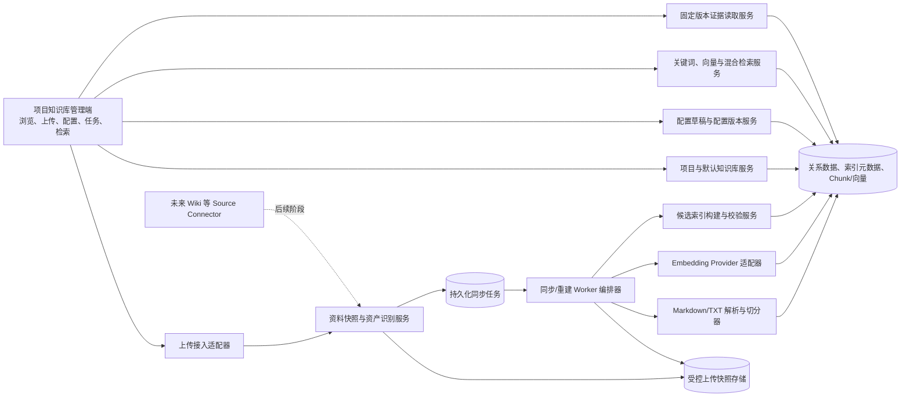
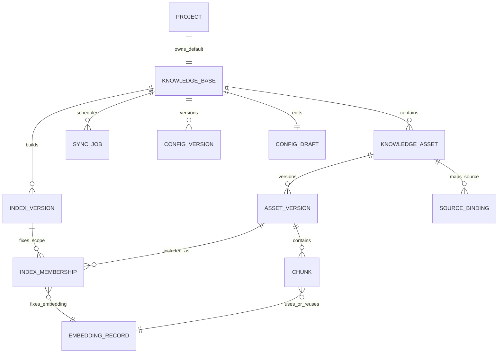
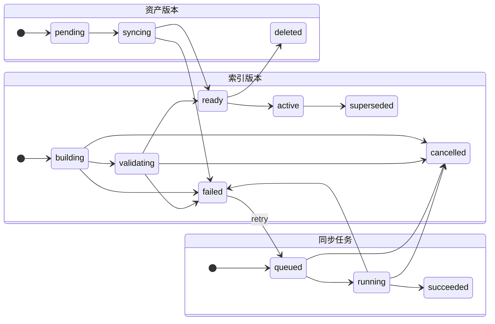
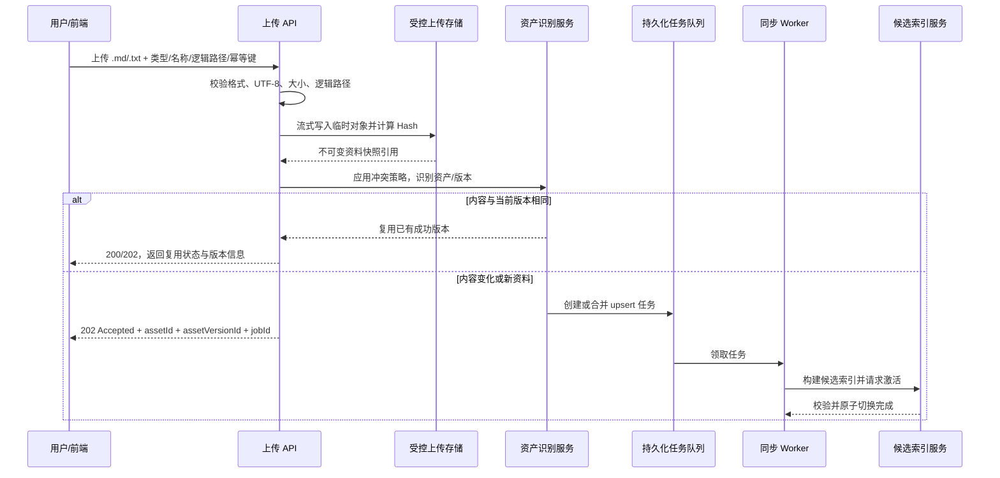
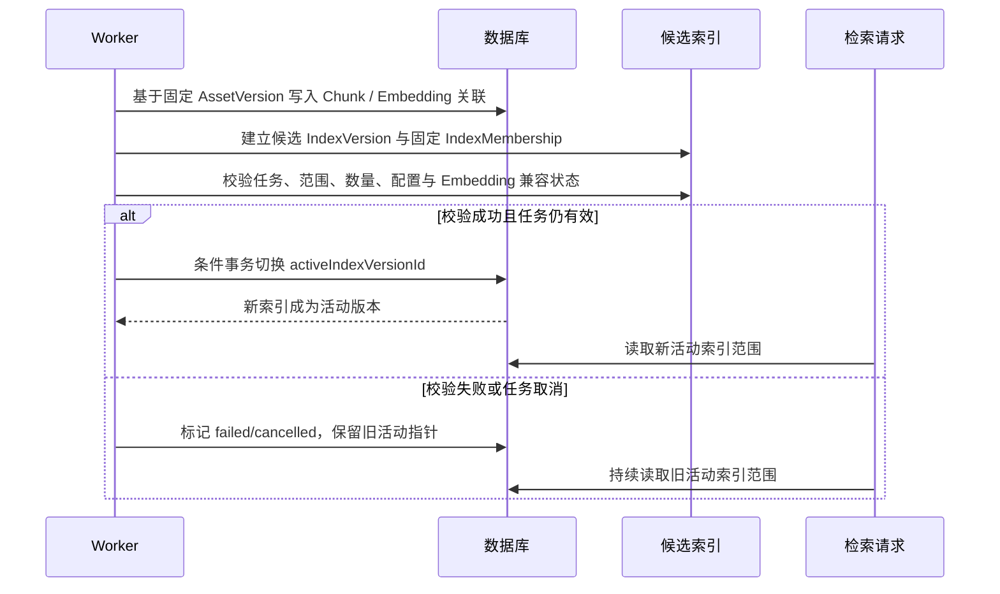
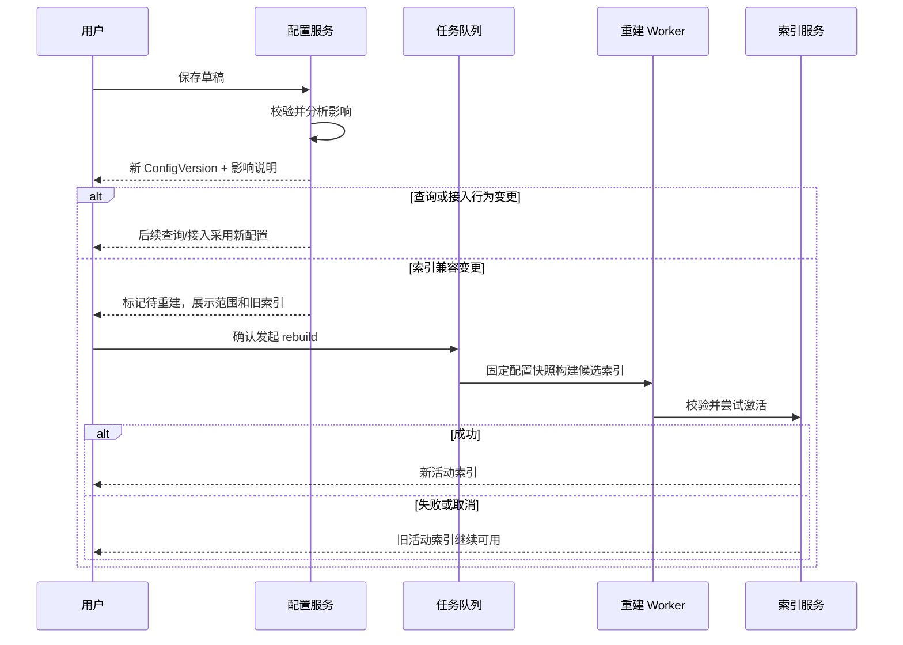

# 第一期：项目知识库构建与配置技术文档

## 1. 文档信息

| 项目 | 内容 |
|---|---|
| 产品名称 | SmartHub |
| 适用阶段 | Phase 1：项目知识库构建与配置 |
| 文档类型 | 技术文档 |
| 文档版本 | V1.2 |
| 文档状态 | 当前技术与架构设计依据，待评审 |
| 实施目标 | 为项目资料提供可靠、可恢复、可追溯的接入、版本、同步、检索与配置基础能力。 |

### 1.1 依据与优先级

| 优先级 | 文档 | 用途 |
|---|---|---|
| 1 | [第一期-项目知识库构建与配置需求文档.md](../需求文档/第一期-项目知识库构建与配置需求文档.md) | 一期功能范围、状态、流程与验收的实施依据。 |
| 2 | [需求总览.md](../需求文档/需求总览.md) | 产品阶段、统一术语、资料边界与跨阶段证据约束。 |

发生冲突时，以优先级更高的文档为准。本方案中的技术选型和参数均为**推荐初版方案**，需要结合团队标准、试点资料规模、性能评测和合规要求确认后实施。

---

## 2. 方案目标、范围、非目标与当前差距

### 2.1 方案目标

1. **统一接入**：网页/API 上传先固化不可变快照并创建持久化任务；未来 Wiki 等连接器复用同一任务和索引切换链路。
2. **版本可追溯**：每个知识资产具有稳定标识；每次内容变化形成不可变资产版本；检索结果始终指向固定版本及原文位置。
3. **增量且幂等**：整体内容 Hash 短路无变化资料；稳定 Chunk 标识与兼容性指纹复用未变化向量；重复上传、重复事件、连续保存和重启恢复不得产生重复结果。
4. **检索持续可用**：新结果必须先构建为候选索引，完整校验后才原子切换为活动索引；同步、重建失败或取消时旧活动索引持续可检索。
5. **配置可控**：配置草稿、已保存配置和活动索引配置快照分离；影响索引兼容性的变更只能经用户确认后异步重建生效。
6. **状态可观察**：能够追踪资料来源、版本、同步步骤、错误、重试、恢复、候选/活动索引及配置快照。

### 2.2 一期交付范围

| 能力域 | 一期范围 |
|---|---|
| 知识库 | 项目创建时自动创建一个默认项目知识库；首期界面不提供多知识库管理。 |
| 资料格式 | UTF-8 Markdown（`.md`）与 UTF-8 纯文本（`.txt`）。 |
| 资料类型 | 需求、技术方案、架构资料、API 文本、数据字典、测试用例、测试报告、缺陷复盘和其他项目说明。 |
| 接入来源 | 网页/API 受控上传；未来 Wiki 等来源通过标准 Source Connector 扩展。 |
| 处理能力 | 内容校验、版本创建、Markdown/TXT 解析、结构化切分、增量 Embedding、候选索引、活动索引切换。 |
| 查询能力 | 关键词检索；Embedding 与活动索引可用时支持向量和混合检索；仅按逻辑路径筛选，资料类型和来源作为固定检索证据元数据返回。 |
| 管理能力 | 资产/版本浏览、固定版本原文查看、同步和重建任务、配置草稿/版本、手动重试、取消与中断恢复。 |

### 2.3 明确非目标与边界

一期不建设或依赖以下能力：

- AI 需求分析、AI 对话、AI 技术方案生成、技术影响分析和方案评审；
- 图片、原型包、HTML、OCR 与多模态解析；
- Git、代码仓库、分支、Commit、PR、代码 Diff、静态分析与代码影响分析；
- 测试设计/执行、Playwright、CI/CD、日志诊断、根因分析和自愈；
- 用户、角色、ACL、审批、SSO、组织级审计、多租户治理；
- OpenAPI、Excel/CSV、PDF、Word 等专用格式解析器；
- 跨项目检索、项目内多业务知识库管理及外部系统来源接入。

### 2.4 当前原型与目标架构的差距

当前仓库已经接入真实知识库 API、持久化任务、候选索引、PostgreSQL/pgvector 和本地或远程 Embedding；其他后续阶段页面仍包含明确标识的原型内容。本节记录当前实现与继续生产化之间的差距。

| 主题 | 当前实现 | 继续优化目标 |
|---|---|---|
| 资料存储 | 不可变原文快照、关系数据与版本元数据已实现。 | 完善备份、配额和回收策略。 |
| 上传接入 | 文件上传先持久化 `queued` 任务，再由 Worker 处理。 | 增加幂等键、租约和多 Worker 压测。 |
| 资产版本 | 稳定资产、不可变版本和 Hash 去重已实现。 | 完善固定历史版本的产品入口。 |
| 切分与向量 | AST Chunk、真实 Token、增量 Embedding 已实现。 | 使用真实评测集校准参数和模型。 |
| 索引 | 候选状态、条件校验、取消保护和活动指针切换已实现。 | 完善失败候选回收与监控。 |
| 检索 | 关键词/向量/混合检索、向量故障降级、来源/逻辑路径筛选和固定版本证据打开已实现。 | 使用真实评测集校准质量指标。 |

---

---

## 3. 核心术语、架构原则与 ADR

### 3.1 领域关系

```text
项目 Project
  └─ 默认项目知识库 KnowledgeBase
       ├─ 知识资产 KnowledgeAsset
       │    └─ 不可变资产版本 AssetVersion
       │         └─ 可检索片段 Chunk
       ├─ 索引版本 IndexVersion
       ├─ 配置草稿 / 配置版本
       └─ 同步、删除与重建任务 SyncJob
```

| 术语 | 定义与规则 |
|---|---|
| 知识资产 | 同一逻辑项目资料的稳定实体，以 `assetId` 标识，文件名和物理路径均不是其唯一身份。 |
| 资产版本 | 知识资产的不可变内容快照，以 `assetVersionId` 标识；`ready` 版本不得原地修改。 |
| Chunk | 资产版本解析得到的可检索片段，具有稳定 `chunkKey`、内容 Hash、标题路径和原文定位。 |
| 索引版本 | 固定配置下、由固定资产版本/Chunk 范围组成的可检索集合；同一知识库同一时刻只有一个活动索引。 |
| 索引成员（`IndexMembership`） | 某索引版本实际使用的固定资产版本、Chunk、显示名称、资料类型、来源、逻辑路径与兼容向量的快照或不可变引用；保证历史检索范围和结果证据可复现。 |
| 候选索引 | 正在构建或等待校验的索引版本；未校验完成前绝不参与默认检索。它是概念阶段，对应正式状态 `building`、`validating`、`ready`。 |
| 来源绑定 | 来源类型、来源标识和逻辑路径到资产的关联；一期记录上传来源，为未来连接器外部 ID 预留。 |
| 配置快照 | 资产版本、Chunk、任务和索引创建时使用的解析、切分、Embedding、检索配置版本。 |

### 3.2 架构原则

1. **资料优先**：先确保来源、版本、定位和检索正确，再为后续智能分析提供输入。
2. **版本优先**：检索、引用和未来分析必须引用 `assetVersionId`，不能以“当前最新文件”替代历史事实。
3. **候选优先**：任何会改变默认检索内容的处理，先写候选、后校验、再切换。
4. **幂等优先**：上传请求、任务重试和恢复被视为至少一次投递；处理链路必须安全地重复执行。
5. **单一资料域**：不设“分析工作区/正式知识库”双域。只有已保存为独立项目资料版本的内容才可成为知识资产。
6. **接口隔离**：上传、未来 Source Connector 和前端只进入服务边界；不得直接写 Chunk、Embedding 或活动索引指针。
7. **渐进演进**：通过 Provider、存储、队列和检索接口隔离扩展点，不以一期非目标的分布式组件为交付前提。

---

## 4. 关键架构决策

### ADR-01：每个项目创建唯一默认知识库

| 项目 | 决策 |
|---|---|
| 背景 | 一期要为后续阶段提供一致的项目资料归属边界，但不需要多知识库治理。 |
| 决定 | 创建项目时创建一个默认 `KnowledgeBase`，以 `projectId` 关联；数据模型保留扩展能力，界面只管理默认库。 |
| 后果 | 所有资料、配置、任务、索引和检索请求必须带项目/默认知识库边界；不建设多库创建、授权和跨库聚合。 |
| 验证 | 新项目可查询稳定知识库 ID、名称、初始配置和无活动索引状态。 |

### ADR-02：上传只生成快照与持久化任务

| 项目 | 决策 |
|---|---|
| 背景 | 上传请求内执行模型调用会阻塞接口，进程中断也无法可靠恢复。 |
| 决定 | 上传 API 仅校验输入、固化不可变资料快照并投递 `SyncJob`；统一由 Worker 执行资产识别、解析、切分、Embedding、候选校验和索引切换。未来连接器复用该边界。 |
| 后果 | 入口快速返回受理结果；长任务状态通过任务 API 查询；中断任务可重新入队。 |
| 验证 | 上传返回时任务为 `queued` 且活动索引未变化；Worker 成功后才激活候选索引。 |

### ADR-03：稳定资产与不可变版本建模

| 项目 | 决策 |
|---|---|
| 背景 | 文件路径和文件名会改变；后续引用必须能回到创建结论时的资料内容。 |
| 决定 | `KnowledgeAsset` 表示逻辑资料，`AssetVersion` 表示内容快照。更新、类型更正和内容替换均创建新版本；重命名尽量保留资产身份。 |
| 后果 | 默认检索只读取活动索引范围；历史版本可浏览并支撑证据定位；清理历史数据必须遵守保留策略。 |
| 验证 | 打开检索结果时显示命中版本内容，而不是同一资产的后续版本。 |

### ADR-04：整体 Hash 短路与稳定 Chunk 增量复用

| 项目 | 决策 |
|---|---|
| 背景 | 重复上传、网络重试和任务恢复可能重复发现同一内容；全量重算会增加成本并产生无效索引。 |
| 决定 | 先比较同资产的整体内容 Hash；内容变化时以稳定 `chunkKey`、Chunk 内容 Hash 与 Embedding 兼容性指纹复用未变化向量。 |
| 后果 | 解析、切分、模型、维度或预处理变更会使旧结果不兼容，必须受控重建；不得只按正文 Hash 复用不同模型的向量。 |
| 验证 | 同内容重复接入不创建版本、不调用 Embedding、不生成索引；只改一个段落时仅变化 Chunk 调用 Embedding。 |

### ADR-05：候选索引和活动指针原子切换

| 项目 | 决策 |
|---|---|
| 背景 | 在更新中先删除旧 Chunk 或索引会让检索出现空窗，失败时也难以恢复。 |
| 决定 | 采用“候选写入 → 完整性校验 → 条件事务切换活动指针 → 延后回收旧数据”模式。 |
| 后果 | 任务和索引需要明确状态；候选结果和旧活动结果可短暂并存；清理为异步、可恢复的独立流程。 |
| 验证 | Embedding、解析、构建失败或任务取消后，旧活动索引仍可检索。 |

### ADR-06：配置按影响分层生效

| 项目 | 决策 |
|---|---|
| 背景 | 直接修改活动索引的解析、Chunk 或模型配置会造成同一索引内数据不兼容。 |
| 决定 | 将配置分为查询行为、索引兼容和接入行为三类；保存产生配置版本，索引兼容类仅在用户确认重建后替换活动索引。 |
| 后果 | 已保存配置、草稿、活动索引配置快照和待重建状态必须同时可见。 |
| 验证 | 修改检索阈值无需重建；修改 Chunk/Embedding 配置未经确认不得影响活动索引。 |

### ADR-07：检索结果必须绑定固定版本证据

| 项目 | 决策 |
|---|---|
| 背景 | 后续 Phase 2/3 需要基于项目事实输出可追溯结论。 |
| 决定 | 检索响应强制包含项目、知识库、资产、资产版本、Chunk、来源、逻辑路径、标题路径、原文定位和索引版本。 |
| 后果 | 原文读取 API 必须接受 `assetVersionId`；前端不得依据 `assetId` 自动跳转最新版本。 |
| 验证 | 同一资产更新后，先前检索记录仍可定位其原始版本和命中位置。 |

---

## 5. 总体逻辑架构

### 5.1 组件架构



### 5.2 组件职责与边界

| 组件 | 职责 | 不负责 |
|---|---|---|
| 项目与默认知识库服务 | 项目创建时初始化默认知识库；返回概览、活动索引和统计。 | 解析资料、直接运行同步任务。 |
| 配置服务 | 维护草稿、已保存配置、影响分析、配置版本及待重建状态。 | 直接修改活动索引内容。 |
| 上传接入适配器 | 校验文件、生成服务端资料快照、记录元数据、创建/合并任务。 | 直接切分、Embedding 或写活动指针。 |
| Source Connector 扩展点 | 未来接入 Wiki 等文档系统，输出固定快照和标准来源元数据。 | 一期直接访问索引或向量数据。 |
| 资料快照与资产识别服务 | 规范化逻辑路径、保存原始资料引用、应用冲突策略、创建待处理版本/任务。 | 直接在请求线程完成长时间模型调用。 |
| 任务存储与 Worker | 持久化状态、领取任务、租约、重试、取消、幂等提交。 | 替代领域服务的业务规则。 |
| 解析与切分器 | 从固定快照提取结构、原文位置和稳定 Chunk。 | 决定资料是否应成为知识资产。 |
| Embedding Provider 适配器 | 批量向量化、健康检查、错误分类、模型元数据。 | 暴露 Provider 特定细节给前端。 |
| 候选索引服务 | 构建固定成员范围、校验、原子激活、延后回收。 | 对未完成候选提供默认检索。 |
| 检索与证据服务 | 在活动索引范围内召回、过滤、排序并返回固定版本定位。 | 将命中内容替换成资产最新版本。 |

### 5.3 信任边界与数据流

```text
浏览器 / API 调用方
  │  不可信文件名、MIME、逻辑路径、幂等键、筛选参数
  ▼
API 边界：认证机制由平台接入层提供；一期不设计产品级 ACL
  │  扩展名、编码、大小、路径规则、请求限流、输入规范化
  ▼
受控应用服务与持久化任务
  │  只读取服务端生成的不可变资料快照
  ├──────────────► 受控上传快照存储
  │
  ├──────────────► 数据库：元数据、任务、Chunk、索引版本、向量
  │
  └──────────────► Embedding Provider：仅发送必要的规范化 Chunk 文本
                         外部 API 地址与密钥属于知识库配置；读取响应与日志不回显密钥
```

- 上传文件名仅作展示元数据；服务端使用生成的对象键或受控路径保存资料快照。
- 未来 Source Connector 必须通过服务边界提交固定快照，不得向 Worker 暴露任意服务器物理路径。

---

## 6. 核心数据模型与一致性设计

### 6.1 逻辑实体关系



### 6.2 逻辑对象与最小字段

| 对象 | 最小字段 | 关键规则 |
|---|---|---|
| `Project` | `projectId`、名称、创建时间 | 是资料、配置及未来分析的隔离边界。 |
| `KnowledgeBase` | `knowledgeBaseId`、`projectId`、名称、`activeIndexVersionId`、当前配置版本、创建/更新时间 | 一期每项目仅一个默认库；活动索引只能指向已校验成功的索引版本。 |
| `KnowledgeAsset` | `assetId`、`knowledgeBaseId`、显示名称、资料类型、当前活动版本、创建/更新时间 | 资产身份独立于路径/文件名；同一逻辑资料更新不改变 `assetId`。 |
| `AssetVersion` | `assetVersionId`、`assetId`、来源类型/标识、逻辑路径、内容 Hash、原始资料引用、状态、配置快照、错误、时间字段 | 内容快照不可变；同资产下相同整体内容 Hash 至多一个版本。 |
| `Chunk` | `chunkId`、`assetVersionId`、`chunkKey`、序号、标题路径、内容 Hash、原文位置、Token 数、Embedding 引用 | 只能属于固定资产版本；原文定位必须可复现。 |
| `EmbeddingRecord` | 规范化输入 Hash、兼容性指纹、Provider/模型/维度、向量引用、状态 | 仅相同输入且相同兼容性指纹可复用。 |
| `IndexVersion` | `indexVersionId`、`knowledgeBaseId`、状态、配置快照、成员范围摘要、创建/激活时间、错误 | 候选版本完成校验后才可激活。 |
| `IndexMembership` | `indexVersionId`、`assetVersionId`、`chunkId`、`chunkKey`、内容 Hash、标题路径、原文定位、显示名称、资料类型、来源、逻辑路径、`embeddingRecordId`、向量维度、兼容性指纹 | 固定索引实际使用的检索成员及其不可变引用，用于审计与可复现查询；资产元数据变更不回写旧成员，重建创建新的成员集合。 |
| `SyncJob` | `jobId`、任务类型、触发来源、输入范围、状态、步骤、进度、尝试数、租约、错误、配置快照 | 同步、删除与重建使用同一可观测任务模型。 |
| `SourceBinding` | `sourceType`、来源对象键/外部 ID、规范化逻辑路径、`assetId` | 一期支撑上传来源；为未来连接器预留稳定外部 ID，不将路径当作资产身份。 |
| `ConfigVersion` / `ConfigDraft` | 配置内容、版本号、影响分类、保存时间、待重建标识、远程来源地址与密钥 | 外部 API 连接按知识库独立保存；读取配置和保存响应仅返回空密钥占位，草稿不覆盖已保存配置；活动索引始终关联实际使用的配置快照。 |

### 6.3 状态机



说明：

- `AssetVersion.ready` 表示已成功进入某个活动索引；旧 `ready` 版本在新版本切换后保留历史可读性，但不再属于默认检索范围。
- `failed` 或 `cancelled` 的任务不能将上一个 `ready` 版本置为失败，也不能更新活动索引。
- `IndexVersion.ready` 表示已通过数据完整性校验但尚未激活；`active` 是唯一默认检索版本；`superseded` 仅保留元数据与恢复窗口。
- 源增量同步方案中的 `candidate` 是候选索引概念，不新增持久化状态：`building` 表示组装成员和向量，`validating` 表示核验任务、成员、配置和兼容性，`ready` 表示已通过校验且尚未激活；`cancelled` 是一期额外保留的显式终态。
- 源方案所称 `IndexChunk` 由一期 `IndexMembership` 承接其“索引实际使用的固定 Chunk 快照”语义，不作为并列领域对象。

### 6.4 关键不变量

1. `KnowledgeBase.activeIndexVersionId` 只能指向状态为 `active` 且已完成完整性校验的索引版本。
2. 同一 `assetId` 下，同一整体内容 Hash 只能对应一个逻辑资产版本。
3. `ready` 资产版本、其 Chunk 和其内容定位不可修改；类型、内容或解析结果更正通过新版本表达。
4. 每个默认检索结果必须能关联到可访问的 `assetVersionId` 和 `chunkId/chunkKey`。
5. 候选索引中的 Chunk、Embedding 与索引配置快照必须兼容；不同模型维度、不同预处理/切分版本不得混入同一活动索引。
6. 失败、取消、进程崩溃、重复投递或乱序事件不得破坏已提交的活动索引。
7. 删除和重命名必须有对应任务或变更记录；不得只删除向量、却留下仍可被默认检索的资料元数据。
8. Worker 在提交前必须检查资产版本、输入范围和配置版本仍是当前有效候选，阻止陈旧任务覆盖更新后的状态。

### 6.5 配置快照与兼容性指纹

建议每个资产版本、Chunk、任务和索引记录以下快照字段：

```json
{
  "parserVersion": "mdast-v1",
  "normalizerVersion": "v1",
  "chunkerVersion": "mdast-v1",
  "embeddingProvider": "provider-id",
  "embeddingModel": "model-id",
  "dimensions": 1536,
  "embeddingTemplateVersion": "v1"
}
```

Embedding 兼容性指纹至少由以下信息组成。远程来源的稳定标识、Base URL、模型与维度属于索引兼容输入；地址或模型变更保存后必须进入受控重建流程。API Key 仅用于鉴权，不写入指纹、不出现在读取响应或日志中：

```text
SHA-256(
  normalizedEmbeddingInputHash + provider + model + dimensions +
  parserVersion + normalizerVersion + chunkerVersion + embeddingTemplateVersion
)
```

只有规范化输入 Hash 与兼容性指纹都一致时，才可以复用历史向量。向量维度仅以 `1536` 作为示例，不是一期固定约束。

---

## 7. 资料接入、同步与索引构建

### 7.1 统一接入规则

上传必须形成下列标准化接入信息；未来 Source Connector 必须复用相同契约：

| 字段 | 说明 |
|---|---|
| `projectId` / `knowledgeBaseId` | 明确归属到项目默认知识库。 |
| `sourceType` | 一期固定为 `upload`；未来连接器使用独立枚举。 |
| `sourceIdentifier` | 一期使用上传对象键；未来可使用 Wiki 页面 ID 等稳定外部标识。 |
| `assetType` | 一期资料类型枚举。 |
| `displayName` | 展示名称；不作为资产唯一键。 |
| `logicalPath` / `canonicalPath` | 知识库内逻辑路径及规范化比较路径。 |
| `contentHash` | 固定快照的整体内容 Hash。 |
| `configVersion` | 接入时适用的已保存配置版本。 |

`canonicalPath` 应统一使用 `/` 分隔符，并按平台规则规范化大小写；Windows 上保留原始逻辑路径用于展示。逻辑路径是发现同一资料的主要键，不是资产永久身份。

### 7.2 上传接入



上传 API 的最小规则：

- 仅允许 `.md`、`.txt` 和完成 UTF-8 解码校验的内容；不得信任客户端 MIME、文件名和存储路径。
- 服务端使用临时对象/受控暂存区生成资料快照，完成后原子移动或提交；不得把用户文件名直接拼接为服务器路径。
- 上传成功仅表示资料已受理或已复用；只有同步、候选构建和活动索引切换完成后版本才成为 `ready`。
- 通过 `Idempotency-Key`、`knowledgeBaseId + canonicalPath + contentHash` 和任务折叠避免网络重试造成重复任务。

### 7.3 未来 Source Connector

一期不实现本地目录监听、扫描或来源对账。未来 Wiki、文档平台等连接器负责自身认证、增量游标、限流、回调和固定来源快照，只能把标准来源元数据与不可变快照投递到现有任务边界。连接器不得直接修改资产版本、Chunk、Embedding 或活动索引；删除语义、全量校准与来源冲突优先级在对应阶段单独设计和验收。

### 7.4 冲突、重命名、删除与连续保存

| 场景 | 处理规则 |
|---|---|
| 同路径冲突 | 按已保存策略处理：`reject` 返回冲突；`new_version` 复用资产并创建不可变版本；`parallel_asset` 创建并列资产且要求区分显示名称。默认是 `new_version`。 |
| 同内容重复上传 | 相同资产且整体内容 Hash 不变时，复用成功结果，不创建版本、任务或索引版本。 |
| 连续上传 | 对相同路径合并尚未执行的任务；提交前校验是否已被更新版本取代。 |
| 重命名且内容不变 | 用户通过知识库文件操作重命名时保留 `assetId`，更新逻辑路径，不重新 Embedding。 |
| 无法确定重命名 | 保守地按删除旧资料和新增资料处理；历史复用是优化，不是正确性前提。 |
| 删除 | 创建删除任务，构建不含该版本的候选索引；切换成功后将受影响版本标记为 `deleted`，历史仍可查看。 |

### 7.5 同步 Worker 算法

```text
1. 以 SKIP LOCKED 或同等机制领取可执行任务，建立任务租约与心跳。
2. 对 knowledgeBaseId + canonicalPath 获取互斥锁，避免同一路径并发写入。
3. 只读取 `SyncJob` 绑定的不可变上传快照；一期 Worker 不监听、扫描或重新对账目录与外部来源。
4. 计算整体内容 Hash；与当前成功版本相同则复用既有成功结果并结束。未来 Source Connector 需要发现内容变化时，必须先固化新的 `AssetVersion` 快照，再投递本通用 Worker 链路。
5. 根据格式解析：Markdown 使用 AST/等价结构；TXT 按段落、行区间切分。
6. 生成每个 Chunk 的标题路径、原文位置、chunkKey、内容 Hash、Token 数与兼容性指纹。
7. 与上一成功版本匹配 Chunk：只有规范化 Embedding 输入、Provider、模型、维度以及解析、规范化、切分和模板版本均由兼容性指纹确认一致时，未变化 Chunk 才可复用 Embedding；新增/变化或不兼容 Chunk 批量调用 Provider；移除 Chunk 不复制至候选版本。
8. 写入完整候选 `IndexVersion` 及其 `IndexMembership` 固定成员集合；成员绑定输入资产版本、Chunk/`chunkKey`、内容和定位、Embedding 记录与兼容性指纹。
9. 完整性校验：任务未取消且仍属当前输入范围，候选索引归属正确，成员和 Chunk 数量完整，Embedding 状态/维度/兼容性以及配置快照均有效。
10. 在单个条件事务中复核当前活动指针未被并发成功任务替换，再更新资产活动版本、知识库活动索引、索引状态、版本状态和任务状态。
11. 异步延后回收失去引用的临时对象、候选数据和过期索引实体；保留版本和索引元数据。
```

任何步骤在提交前失败时，任务标记为 `failed` 或 `cancelled`，候选结果可清理，但旧活动版本与旧活动索引不得变化。

### 7.6 Markdown/TXT 解析和稳定切分

#### Markdown

- 使用 AST 或等价结构化解析，保留标题层级、正文、列表、代码块、表格、链接与原文定位。
- 以标题树为一级边界；单个 Chunk 携带完整 `headingPath`，如 `['部署', 'Docker', '离线安装']`。
- 标题内容过长时按 AST 块继续切分；代码块和表格原则上不在中间截断，超过模型上限时使用显式拆分规则并标记元数据。
- 初版可从目标约 400～800 tokens、硬上限约 1,000 tokens、重叠约 50～100 tokens 开始；实际参数必须依据检索评测调整。

#### 纯文本

- 优先以空行分隔段落；长段落再按自然行区间或句子边界拆分。
- 每个 Chunk 记录起止行号或字符区间，确保结果可以回到固定版本原文。
- 使用局部文本锚点和出现序号生成稳定标识，避免头部插入内容导致整篇所有 Chunk 失效。

#### Hash 与 `chunkKey`

```text
sectionKey   = SHA-256(normalizedHeadingPath)
localAnchor  = 当前结构块首段的规范化文本摘要
chunkKey     = SHA-256(sectionKey + localAnchor + occurrence)
contentHash  = SHA-256(normalizedEmbeddingInput)
```

匹配顺序：

1. 在同一资产的相邻成功版本中按 `chunkKey` 精确匹配；
2. 对未匹配项，在相同 `sectionKey` 中按 `contentHash` 和相邻顺序匹配；
3. 只有内容与兼容性指纹均一致时复用向量。

Hash 规范化只能统一换行符、Unicode 表示和非语义尾随空白。不得压平所有空白，否则代码缩进等语义变化可能被错误视为无变化。

### 7.7 候选索引、校验与原子切换



原子切换事务至少应：

- 确认候选索引状态为 `ready` 且属于当前目标知识库和任务；
- 确认任务未取消，输入资产版本和配置版本没有被更新的任务取代；
- 确认固定 `IndexMembership` 集合完整，并且全部关联的 Chunk、Embedding 记录、向量维度和兼容性指纹有效；
- 确认当前活动指针未被其他成功任务替换；
- 更新 `KnowledgeBase.activeIndexVersionId`；
- 更新受影响 `KnowledgeAsset.activeVersionId`；
- 将候选索引标记为 `active`，先前活动索引标记为 `superseded`；
- 将相关资产版本标记为 `ready` 并完成任务。

---

## 8. 配置与受控重建

### 8.1 配置模型

配置页面必须同时展示：

1. **编辑草稿**：仅在用户编辑会话中存在，离开时可提示未保存变更。
2. **已保存配置版本**：保存成功后形成递增版本；无变化不得生成无意义版本。
3. **活动索引配置快照**：当前默认检索实际使用的配置，可能落后于最新已保存索引兼容配置。
4. **模型来源与远程连接配置**：每个知识库独立维护本地或远程来源；远程来源包含名称、Base URL、可选 API Key 和模型列表，可检测模型维度。API Key 可写入并随配置版本保存，但读取配置和保存响应仅返回空值；保存时空值表示保留当前已保存密钥。
5. **待重建状态**：已保存的索引兼容变更尚未经确认构建新索引时，明确显示影响范围和旧活动索引。

### 8.2 配置影响分类

| 类型 | 示例 | 生效规则 |
|---|---|---|
| 查询行为变更 | 关键词/向量召回数、最终返回数、阈值、混合权重 | 保存后用于后续查询，不重建索引。 |
| 索引兼容变更 | 解析器、Chunk 大小/重叠、标题策略、预处理版本、Embedding Provider/模型/维度/模板 | 保存后显示待重建；仅经用户确认、候选构建和原子切换后改变默认索引。 |
| 接入行为变更 | 默认资料类型、路径规则、上传冲突策略 | 保存后用于后续上传，不回写历史版本。 |

### 8.3 保存与重建时序



首次建库没有旧活动索引时，页面必须显示“正在建立首个索引，向量检索暂不可用”，而不是把该状态展示为无匹配或系统故障。

---

## 9. 浏览、检索与证据定位

### 9.1 资产浏览

浏览接口和页面应支持：

- 按版本状态、逻辑路径过滤；资料类型和来源作为资产元数据展示，不作为浏览谓词；
- 按名称、逻辑路径和内容关键词搜索；
- 查看资产概要、来源、当前活动版本、版本历史、内容 Hash、最近同步时间、最近错误；
- 读取指定 `assetVersionId` 的原始 Markdown/TXT、标题结构、Chunk 列表和同步详情；
- 默认隐藏 `deleted` 版本，允许显式查看历史删除记录。

### 9.2 查询执行模型

```text
SearchRequest(projectId, filters, mode)
  → 查找项目默认 KnowledgeBase
  → 获取活动 IndexVersion 与其固定成员范围
  → 判断当前能力状态
  → 关键词召回 / 向量召回 / 混合融合
  → 按逻辑路径过滤
  → 从 IndexChunk 固定快照返回资产元数据、固定资产版本、Chunk、标题路径与原文定位
```

默认查询只读取当前活动索引的成员范围，而不是“数据库中所有最新资产版本”。

| 模式 | 行为 |
|---|---|
| 关键词检索 | 对活动 Chunk 执行正文关键词召回，不依赖 Embedding Provider，适合术语、错误码、变量名和精确短语。 |
| 向量检索 | 在查询 Embedding、Provider 与活动向量索引均可用时，对查询向量进行近邻召回；不可用时返回明确 `KB_VECTOR_UNAVAILABLE`，不得以无匹配代替。 |
| 混合检索 | 分别召回关键词与向量候选，以可解释权重融合；查询向量不可用时保留关键词结果，返回 `KB_DEGRADED_KEYWORD_ONLY` 与原因。 |
| 二阶段 Reranker | 按配置对一阶段候选重排；不可用时保留一阶段排序，返回 `KB_DEGRADED_RERANKER_BYPASSED` 与原因。 |

### 9.3 检索响应契约

每条检索结果至少返回：

```json
{
  "projectId": "...",
  "knowledgeBaseId": "...",
  "indexVersionId": "...",
  "assetId": "...",
  "assetVersionId": "...",
  "assetType": "technical_design",
  "displayName": "支付重构技术方案",
  "sourceType": "upload",
  "logicalPath": "技术方案/支付重构.md",
  "chunkId": "...",
  "chunkKey": "...",
  "headingPath": ["同步策略", "失败恢复"],
  "location": { "startLine": 120, "endLine": 150 },
  "snippet": "...",
  "retrievalMode": "hybrid",
  "degraded": false,
  "degradationReasons": [],
  "rerankerApplied": true,
  "scores": { "keyword": 0.7, "vector": 0.86, "firstStage": 0.89, "final": 0.92 }
}
```

打开结果必须请求 `assetVersionId` 对应的原文，并定位到 `location`。不允许仅凭 `assetId` 查询“当前最新版”后替换用户命中的内容。

### 9.4 检索不可用状态

接口和页面应区分以下情况，避免以空列表误导用户：

| 状态码/业务码 | 场景 | 建议提示与能力 |
|---|---|---|
| `KB_NO_READY_VERSION` | 知识库尚无 `ready` 资产版本 | 提示上传/等待同步。 |
| `KB_NO_ACTIVE_INDEX` | 没有活动索引 | 首次建库提示当前进度。 |
| `KB_INITIAL_INDEXING` | 首个索引构建中 | 明确索引建立进度，不以无匹配代替。 |
| `KB_VECTOR_UNAVAILABLE` | 纯向量模式的查询向量、Provider 或兼容索引不可用 | 明确该向量请求未执行，不返回伪空结果。 |
| `KB_DEGRADED_KEYWORD_ONLY` | 混合模式的查询向量或 Provider 不可用 | 返回关键词结果、降级阶段与原因。 |
| `KB_DEGRADED_RERANKER_BYPASSED` | Reranker 调用失败或不可用 | 保留一阶段排序并返回降级原因。 |
| `KB_FILTER_EMPTY` | 逻辑路径筛选条件排空 | 提示调整逻辑路径筛选。 |
| `KB_NO_MATCH` | 正常检索无结果 | 提示无匹配，保留查询条件。 |

---

## 10. 服务接口与异步契约

本节定义资源和行为边界，不要求在一期立即提交完整 OpenAPI 文件。

### 10.1 API 资源组

| 资源组 | 关键操作 |
|---|---|
| 项目与默认知识库 | 获取项目默认知识库、概览、统计、活动索引状态。 |
| 配置与配置版本 | 读取/保存草稿、查询已保存版本、影响分析、待重建状态。 |
| 上传接入 | 上传资料、传入类型/显示名称/逻辑路径/冲突模式/幂等键，获取受理结果。 |
| 未来连接器 | Wiki 等外部文档来源；一期不提供管理 API。 |
| 资产与版本 | 列表/过滤、详情、版本历史、固定版本原文、Chunk、来源记录。 |
| 同步与重建任务 | 任务列表/详情、步骤/进度/错误、重试、取消。 |
| 索引版本 | 当前/候选/历史索引、配置快照、成员范围摘要、切换结果。 |
| 检索与证据 | 关键词/向量/混合检索，获取固定版本原文和定位。 |

### 10.2 长任务约定

- 上传同步、删除处理和索引重建均为异步任务，返回 `202 Accepted` 和 `jobId`。
- 客户端通过 `GET /sync-jobs/{jobId}` 轮询，或通过 SSE/事件流订阅状态；具体推送机制可按平台能力确认。
- 同步和重建进度至少包含任务状态、当前步骤、已处理/总数、尝试次数、错误摘要、配置快照及可取消性。
- 上传请求支持 `Idempotency-Key`；同一键的安全重试返回同一受理结果，或显式告知已有任务状态。

### 10.3 一致性与错误语义

| HTTP 状态 | 场景 |
|---|---|
| `200 OK` | 读取成功、无变化资料已复用成功版本。 |
| `202 Accepted` | 资料已受理或重建已投递，等待异步完成。 |
| `400 Bad Request` | 文件格式、UTF-8、逻辑路径、筛选参数或配置格式无效。 |
| `404 Not Found` | 项目、知识库、资产、固定版本或任务不存在。 |
| `409 Conflict` | 路径冲突策略为 `reject`、并发配置保存冲突、条件切换失败或非法状态转换。 |
| `413 Payload Too Large` | 单文件、请求体或批量上传超过限制。 |
| `422 Unprocessable Entity` | 内容无法解析或业务规则不允许处理。 |
| `429 Too Many Requests` | 上传或 Provider 调用超出配额。 |
| `5xx` | 未预期服务错误；响应携带可诊断的 `traceId`。 |

稳定错误结构建议：

```json
{
  "code": "KB_INVALID_UTF8",
  "message": "文件不是有效的 UTF-8 文本，无法接入知识库。",
  "traceId": "...",
  "retryable": false,
  "details": {
    "stage": "validation"
  }
}
```

错误详情不得包含完整资料正文、完整 Embedding 请求或密钥。

---

## 11. 安全、可靠性与运维

### 11.1 接入与数据安全

| 风险 | 控制措施 |
|---|---|
| 恶意文件/伪造 MIME | 服务端校验扩展名、内容、UTF-8 解码和大小；不只依赖 MIME。 |
| 路径穿越和符号链接逃逸 | 受控根目录白名单、真实路径解析、根目录包含性校验、拒绝设备/目录/不可读文件。 |
| 上传覆盖服务器文件 | 服务端生成对象键；原始文件名仅作为展示数据。 |
| 资源耗尽 | 限制单文件大小、单次文件数、项目总容量、最大 Chunk 数、任务并发和请求速率；具体阈值待试点确认。 |
| Markdown 外部副作用 | 不对 Markdown 链接、图片或 HTML 执行外部抓取；一期只处理允许的文本结构。 |
| 外部 API 凭据泄露 | 远程 Provider 的地址和 API Key 由当前知识库配置维护；配置读取和保存响应只返回空密钥，日志、错误与任务展示均脱敏 URL 和凭据。运行环境必须限制知识库配置接口的访问权限，并使用受控数据库备份与传输加密保护持久化密钥。 |
| 资料/向量泄露 | 日志只记录 ID、Hash、长度、阶段和摘要；脱敏完整正文、请求文本和向量值。 |
| 云端模型数据边界 | 评审数据出域、驻留、服务端保留和供应商政策；敏感资料使用合规的本地/私有 Provider。 |

用户在“知识库配置”中为当前知识库添加远程来源，填写来源名称、Base URL、可选 API Key 和模型；服务端在对应 `ConfigVersion` 中保存连接信息，并在任务、重建和查询时按各自绑定的配置快照解析路由。不同知识库即使使用相同来源或模型名称，也可使用不同地址和凭据。远程模型检测请求携带当前编辑草稿，检测结果只回填模型维度，用户保存后才生成新配置版本。`GET /config` 和 `PUT /config` 的响应不回显 `apiKey` 或 `embeddingApiKey`；空密钥提交表示保留当前值，只有显式的新非空值才替换已保存密钥。错误、任务详情和日志继续脱敏 URL、Bearer Token 及 API Key。

一期不定义产品级用户权限、审批和审计模型，但部署接入层仍应使用平台已有的身份认证、网络隔离和最小化运行账户。

### 11.2 任务可靠性

- 使用持久化任务表或同等可靠队列保存任务状态、尝试次数、可执行时间、租约、锁定 Worker、错误和配置快照。
- Worker 领取任务后定期心跳；租约超时的 `running` 任务可被安全接管。
- 429、超时和可恢复的 5xx 按最大尝试次数、指数退避和抖动重试；编码非法、文件超限、解析规则不支持等确定性错误直接失败。
- 对同一路径或同一资产范围采用互斥锁/条件更新，防止多个 Worker 竞态提交。
- 用户取消只清理未提交候选结果；旧活动索引和历史版本不回滚、不删除。
- 数据库恢复后，可依据原始资料快照、来源绑定、资产版本和配置快照重新建立候选索引。

### 11.3 可观测性

建议指标：

| 维度 | 指标 |
|---|---|
| 接入 | 上传量、拒绝量、格式/编码失败率、重复内容短路比例。 |
| 同步 | 队列深度、同步延迟、成功/失败/取消/重试率、死信或最终失败数。 |
| 增量效率 | 无变化同步比例、Chunk 新增/修改/删除/复用数、Embedding 缓存命中率。 |
| Provider | 批量大小、调用耗时、超时、限流、错误率、Token/费用（若 Provider 可提供）。 |
| 索引 | 候选构建时长、校验失败率、活动索引年龄、切换次数、重建成功率。 |
| 检索 | 关键词/向量/混合延迟、零结果率、筛选排空率、固定证据定位成功率。 |
| 恢复 | 中断任务恢复数、陈旧候选拒绝数、恢复失败数和未处理异常。 |

结构化日志应关联 `traceId`、`jobId`、`projectId`、`knowledgeBaseId`、`assetId`、`assetVersionId`、`indexVersionId` 和规范化路径摘要。日志不得写入完整资料内容。

### 11.4 备份、保留与回收

- 对关系数据、原始资料快照、活动/历史索引元数据分别定义备份和恢复策略。
- `AssetVersion`、`IndexVersion` 和证据引用的保留期限必须满足后续结论追溯；在保留期内不得因索引清理删除被引用原文。
- 候选失败数据、临时上传对象、失去引用的 Chunk/向量可延后异步清理，并保留可观测记录。
- 保留周期、最大历史版本数、原始资料与向量是否同周期清理，需要在实施前确认。

---

## 12. 推荐初版技术与演进条件

以下内容是可替换的推荐初版，而不是已批准的硬性技术栈。

| 能力 | 推荐初版 | 替换/演进条件 |
|---|---|---|
| 服务端 | Node.js 22 + TypeScript | 团队已有服务标准、运行环境或性能要求不同。 |
| Markdown 解析 | `unified`、`remark-parse`、`mdast-util-to-string` | 需要更严格 AST、表格语义或多格式适配时。 |
| Source Connector | 后续按 Wiki/文档平台分别实现适配器 | 需要接入外部资料来源时单独立项并复用任务契约。 |
| 原始资料存储 | 受控本地目录或对象存储 | 运行环境、备份、容量或合规要求变化。 |
| 事务数据与任务 | PostgreSQL 16+ 与数据库 Job 表 | PostgreSQL 是生产和验收的事务真相来源；并发、吞吐、跨服务解耦需要 Redis/BullMQ 或消息队列。 |
| 向量存储 | pgvector，先用精确检索建立质量基线 | 负责向量近邻召回；数据量、延迟或并发评测证明需要 HNSW、分片或专用向量数据库。 |
| 正文关键词检索 | PostgreSQL 全文检索（FTS） | 负责正文词法/分词检索；多语言分词、复杂排序或规模需要独立搜索服务。 |
| 短文本模糊匹配 | `pg_trgm` | 补充资料名称、逻辑路径、标题与标题路径的模糊、前缀或子串匹配，不替代正文 FTS。 |
| 混合排序 | FTS、短文本补强和向量候选加权融合，可选 Reranker | 有真实评测集后校准权重、阈值和重排模型。 |
| Embedding | 可插拔云端或本地 Provider | 数据驻留、合规、成本、时延、语言能力或离线部署要求变化。 |

初版不应同时维护关系数据库和独立向量数据库，也不应把 reranker、独立消息队列或分布式编排作为一期上线前提。若保留 JSON Store，只能在未配置 PostgreSQL 时作为单机开发回退；它不提供多实例互斥、数据库条件事务、生产级崩溃恢复或正式验收等价保证。

### 12.1 建议部署拓扑

```text
管理端 Web / API 网关
  ├─ 项目知识库 API 服务
  ├─ 上传临时存储 / 受控对象存储
  ├─ 一个或多个同步/重建 Worker
  ├─ PostgreSQL（元数据、任务、全文索引、向量能力）
  └─ Embedding Provider（本地或合规云端）
```

初期可以将 API 和 Worker 部署在受控环境的独立进程/容器中，共享数据库和原始资料存储。随着资料规模、Provider 延迟或任务吞吐增长，再将 Worker 横向扩展、引入独立队列或评估专用向量服务；未来 Source Connector 作为独立适配器接入任务边界。

### 12.2 性能与质量基线

以下为试点参考目标，必须按真实资料集、Provider 限流和评测问题校准，不能在缺少样本时作为不可调整的上线承诺：

- 普通 Markdown/TXT 资料保存后通常在数秒内完成同步；
- 未变化 Chunk 的向量复用率目标大于 95%；
- 10 万 Chunk 规模下检索 P95 参考目标低于 300ms；
- 活动索引中重复 Chunk 数为 0；
- 同步任务最终成功率参考目标大于 99.9%。

---

## 13. 实施里程碑

| 里程碑 | 交付内容 | 主要需求 | 完成判定 |
|---|---|---|---|
| M0：实施准备与决策冻结 | 确认试点资料、容量、路径规则、资料类型、Provider、存储、数据边界与保留策略。 | 前置条件、FR-004、FR-008 | 开放决策有责任人和结论，具备试点运行环境。 |
| M1：领域与持久化基础 | 默认知识库、资产/版本/Chunk/`IndexMembership`/索引/任务/配置模型、状态机、唯一约束与配置快照。 | FR-001、FR-003～005、FR-010、FR-012 | 新项目自动获得默认库；固定成员和兼容性不变量具备自动化验证。 |
| M2：统一资料接入 | 上传快照、文件校验、来源标识、冲突策略、任务受理和未来连接器边界。 | FR-006～011 | 上传只创建持久化任务；重复内容不创建重复版本。 |
| M3：增量同步与可靠发布 | 解析、Chunk、Hash、兼容性隔离、Provider、Worker、候选索引固定成员、原子切换、重试/取消/中断恢复。 | FR-012～016 | 局部修改只处理变化 Chunk；失败、取消和重启不影响旧活动索引。 |
| M4：浏览、检索与配置重建 | 资产/版本浏览、证据读取、FTS/向量/混合检索、模式化不可用与降级状态、草稿与重建。 | FR-002、FR-017～022 | 知识库前端接入真实 API；检索可定位固定版本并区分降级。 |
| M5：试点验收与运维就绪 | 日志指标、备份恢复演练、安全测试、真实资料与问题集评测、验收证据包。 | AC-001～AC-009 | 完成验收场景、质量基线和容量/演进结论。 |

M1 是后续工作的前置；M2 依赖资产、任务和来源模型；M3 依赖固定资料快照；M4 依赖活动索引与固定版本读取；M5 从 M2 开始积累指标，并在 M4 完成后闭环端到端验收。

---

## 14. 需求追溯、测试与验收设计

### 14.1 功能需求追溯

| 需求 | 架构落点 | 主要验证证据 |
|---|---|---|
| FR-001 默认知识库创建 | ADR-01、`Project`/`KnowledgeBase`、项目服务 | 创建项目后自动存在唯一默认库、稳定 ID 和初始索引状态。 |
| FR-002 知识库概览 | 项目服务、任务/索引/资产聚合查询 | 展示资产统计、来源/类型分布、最近同步和活动索引。 |
| FR-003 配置草稿与保存 | `ConfigDraft`、`ConfigVersion`、第 8 章 | 草稿/已保存差异、无变化不可重复保存、保存产生版本。 |
| FR-004 可配置项 | 配置模型、Provider/解析/接入接口 | 接入、解析切分、Embedding、检索参数均有保存与快照。 |
| FR-005 配置影响提示 | ADR-06、配置分类、受控重建时序 | 三类变更按不同语义生效并展示影响。 |
| FR-006 统一接入链路 | ADR-02、第 7.1 节 | 上传统一产生资产/任务/候选索引语义；未来连接器复用该契约。 |
| FR-007 受控上传 | 第 7.2、10、11 章 | 格式、编码、路径/大小校验；返回异步受理，不伪装为同步成功。 |
| FR-008 上传与连接器边界 | 第 7.3、10.1 节 | 一期仅上传；未来 Wiki 等连接器只投递固定快照和标准任务。 |
| FR-009 冲突策略 | 第 7.4、`SourceBinding` | `reject`、`new_version`、`parallel_asset`，默认新版本与内容去重。 |
| FR-010 资产识别与版本 | ADR-03、第 6 章 | 稳定 `assetId`、不可变 `assetVersionId`、历史可访问。 |
| FR-011 删除/重命名/连续上传 | 第 7.4、任务条件校验 | 删除候选切换、重命名复用和 Hash 任务折叠。 |
| FR-012 同步任务链路 | 第 7.5、任务状态机 | 完整步骤、输入范围、进度、重试、配置快照和条件提交。 |
| FR-013 Hash 与增量同步 | ADR-04、第 6.5、7.6 节 | 整体 Hash 短路、稳定 Chunk、兼容指纹、局部 Embedding。 |
| FR-014 失败/重试/取消 | 第 6.3、7.5、11.2 节 | 错误阶段、重试、取消候选，旧活动索引持续可用。 |
| FR-015 异步任务恢复 | ADR-02、7.5、11.2 节 | 中断任务重新入队、废弃候选失效、恢复前条件校验。 |
| FR-016 原子索引切换 | ADR-05、第 6.2、7.7 节 | 固定 `IndexMembership`、候选校验、条件事务、旧索引保留、索引范围与快照可见。 |
| FR-017 资产浏览 | 第 9.1、10.1 节 | 状态/路径筛选，资料类型和来源展示，版本/Chunk/固定原文详情。 |
| FR-018 基础检索 | ADR-07、第 9.2、9.3 节 | 关键词/向量/混合及逻辑路径筛选；返回固定索引成员元数据、固定版本证据、检索模式、阶段分数和降级字段。 |
| FR-019 不可用提示 | 第 9.4 节 | 区分无版本、无索引、首次建库、纯向量不可用、混合关键词降级、Reranker 降级、筛选排空和无匹配。 |
| FR-020 重建触发确认 | 第 8.2、8.3 节 | 受影响范围、旧索引、用户确认与范围化 rebuild 任务。 |
| FR-021 重建过程与结果 | ADR-05、8.3、11.2 节 | 进度、取消、成功切换、失败保旧索引、新旧版本快照。 |
| FR-022 任务与错误可见性 | 任务模型、11.3、10.1 节 | 任务、错误、重试、候选/活动索引、恢复和配置快照可见。 |

### 14.2 验收场景与测试层级

| 验收 | 架构验证场景 | 建议证据 |
|---|---|---|
| AC-001 默认库 | 创建新项目，读取默认库与初始索引状态。 | API 响应、数据库唯一约束、页面截图。 |
| AC-002 多类型资料 | 上传各资料类型的 Markdown/TXT，确认类型作为资产与检索证据展示。 | 资产/版本记录、列表与证据结果。 |
| AC-003 重复内容 | 同路径重复上传完全相同内容。 | 相同版本 ID、无新增任务/Embedding/索引记录。 |
| AC-004 局部更新 | 修改多标题 Markdown 的一个段落。 | 新资产版本、稳定 Chunk、Embedding 复用与变化统计。 |
| AC-005 异步任务恢复 | 上传入队、执行中取消和 `running` 任务重启恢复。 | `queued/running/cancelled` 记录、候选状态、活动索引未误切换。 |
| AC-006 失败恢复 | 模拟解析、Embedding、索引构建失败，再重试。 | `failed` 任务详情、旧索引仍可检索、重试后切换记录。 |
| AC-007 检索定位 | 关键词/向量/混合检索后打开一个结果，并模拟向量或 Reranker 不可用。 | 固定成员/索引版本、固定版本原文与标题/行号定位；混合关键词降级、纯向量明确不可用与 Reranker 回退语义。 |
| AC-008 配置重建 | 分别修改阈值、Chunk 和模型参数，模拟成功/失败/取消。 | ConfigVersion、待重建状态、任务记录、新旧索引快照。 |
| AC-009 AI 产物边界 | 对比未保存的中间产物与人工保存的独立资料。 | 前者不在资产/检索中；后者走统一版本与同步链路。 |

### 14.3 分层验证策略

| 层次 | 验证重点 |
|---|---|
| 领域与事务测试 | 唯一性、状态机、配置版本、活动指针条件切换、并发任务和取消竞态。 |
| 解析与切分测试 | Markdown 标题路径、列表、代码块、表格、TXT 行范围和稳定 `chunkKey`。 |
| 接入与同步集成测试 | 异步上传、重复上传、连续提交、重命名、删除、Worker 接管和中断恢复。 |
| 增量与成员测试 | 局部修改复用兼容向量；模型、维度、解析、切分、模板变化隔离旧向量；重建创建新的 `IndexMembership`，不改写旧成员或资产版本 Chunk。 |
| 发布与并发测试 | 候选成员完整性、条件激活、取消/失败/陈旧任务保护、PostgreSQL 多 Worker 并发与活动指针竞争。 |
| 检索与证据测试 | 关键词、纯向量、混合、筛选、固定版本原文、混合关键词降级、纯向量明确不可用、Reranker 回退和无结果语义。 |
| 配置与重建测试 | 查询参数即时生效、兼容配置待重建、成功/失败/取消时旧索引连续可用。 |
| 安全测试 | 路径穿越、符号链接、伪造 MIME、非法 UTF-8、超限文件与日志脱敏。 |
| 试点验收 | 真实资料与问题集上的同步时效、复用率、检索召回、定位正确率与恢复行为。 |

---

## 15. 风险、取舍、待确认决策与文档维护

### 15.1 主要风险与控制

| 风险 | 影响 | 控制措施 |
|---|---|---|
| Worker 中断或陈旧任务完成 | 候选覆盖新索引 | 持久化任务恢复、候选失效、配置/成员/取消状态条件校验。 |
| 配置/模型变更造成向量混用 | 召回质量不可解释、查询错误 | 兼容性指纹、候选重建、配置快照和活动索引原子切换。 |
| Embedding Provider 不稳定 | 同步失败、向量检索降级 | 可重试错误策略、健康检查、关键词检索保底、Provider 可插拔。 |
| 频繁小变更导致过多索引构建 | 成本和资源压力 | 任务折叠、短窗口批处理、固定候选成员范围；具体窗口经试点评估。 |
| 历史数据过早回收 | 证据失效、后续分析不可追溯 | 版本/引用保留策略、延后回收、备份恢复和清理审计记录。 |
| 云端模型数据出域 | 合规与资料泄露 | 明确数据边界，选择本地/合规 Provider，最小化发送和日志脱敏。 |

### 15.2 待确认决策

以下事项影响数据模型、部署、成本、恢复语义或验收阈值，实施前应由产品、技术和运维共同确认：

1. 单文件大小、每项目资料数、Chunk 数、任务并发、历史版本与索引保留周期；
2. 默认知识库命名、既有项目补建及项目生命周期服务的集成方式；
3. 逻辑路径规范、Windows 大小写规则，以及重复上传同路径时的最终冲突默认值；
4. Wiki 等 Source Connector 的后续优先级、外部 ID、增量游标、删除语义与来源覆盖规则；
5. Embedding Provider、模型、维度、费用上限、数据驻留、密钥托管和故障降级要求；
6. Markdown front matter、表格、代码块、超长段落、无标题资料的切分与精确定位细则；
7. 关键词/向量/混合检索的默认参数、真实评测问题、期望来源、质量阈值和可接受时延；
8. 索引切换的批处理窗口：建议初版采用短窗口合并变更、构建固定成员清单后原子切换，同时保留单资产即时同步扩展能力；
9. 原始资料、历史版本、向量、索引和任务日志的备份、恢复、删除和合规保留策略；
10. OpenAPI、Excel、PDF、Word、Wiki/Git/外部系统、多知识库与权限治理的后续阶段优先级。

### 15.3 文档关系与维护规则

| 文档 | 关系 | 使用规则 |
|---|---|---|
| [第一期-项目知识库构建与配置需求文档.md](../需求文档/第一期-项目知识库构建与配置需求文档.md) | 一期需求与验收依据。 | 范围、状态、FR、AC 出现冲突时以该文档为准。 |
| [需求总览.md](../需求文档/需求总览.md) | 产品总览、统一术语与跨阶段约束。 | 一期实现不得突破其阶段边界和证据约束。 |
| 本文档 | 一期技术方案、架构设计、实施与验收追溯。 | 是一期唯一技术与架构设计依据；技术组件、参数和部署建议需经评审确认后才可固化。 |

后续新增资料格式、接入来源、多知识库、AI/Git/测试/权限能力时，必须单独形成相应阶段的需求和技术方案；不得将“预留字段”或本期实现扩展解释为功能已交付。

---

## 附录 A：一期枚举建议

### A.1 资料类型

```text
requirement | technical_design | architecture | api_spec |
data_dictionary | test_case | test_report | defect_review | other
```

### A.2 来源类型

```text
upload
```

### A.3 任务类型

```text
upsert | delete | rebuild
```

### A.4 状态枚举

```text
AssetVersion: pending | syncing | ready | failed | deleted
SyncJob:      queued | running | succeeded | failed | cancelled
IndexVersion: building | validating | ready | active | superseded | failed | cancelled
```

## 附录 B：实施顺序建议

1. 建立项目默认知识库、资产/版本/Chunk/索引/任务/配置的持久化模型与事务约束。
2. 实现上传资料快照、持久化任务、Worker 领取、中断恢复和幂等条件提交。
3. 实现 Markdown/TXT 解析、稳定切分、Hash 策略、Embedding Provider 接口与复用。
4. 实现候选索引、完整性校验、活动指针切换、关键词检索和固定版本证据读取。
5. 实现配置草稿、配置版本、影响分析、受控重建、任务取消与恢复。
6. 将知识库前端接入真实 API；后续原型页面继续明确标注模拟边界。
7. 以试点资料集完成性能、恢复、检索质量和 AC-001～AC-009 验收，根据结果决定队列、索引和部署演进。
